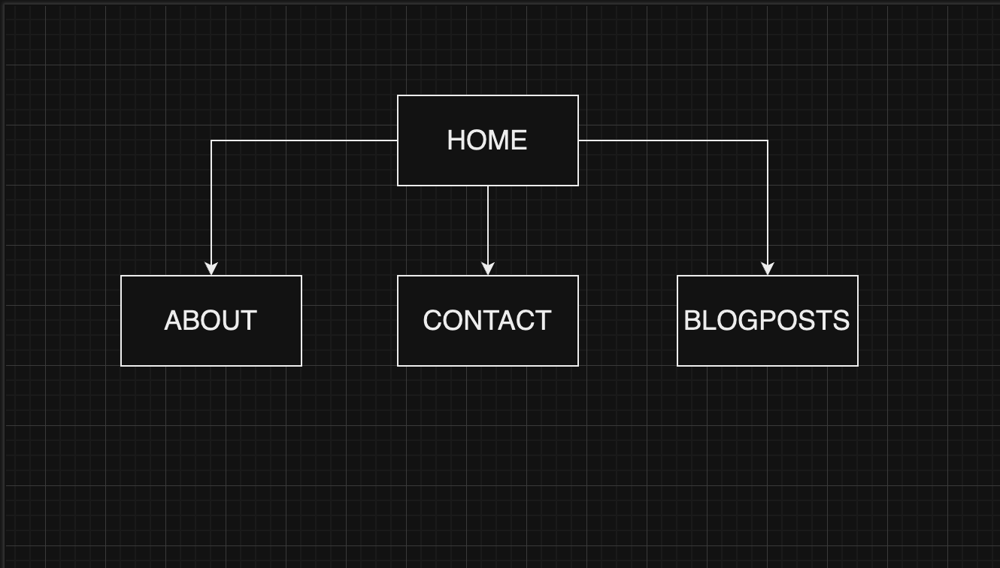
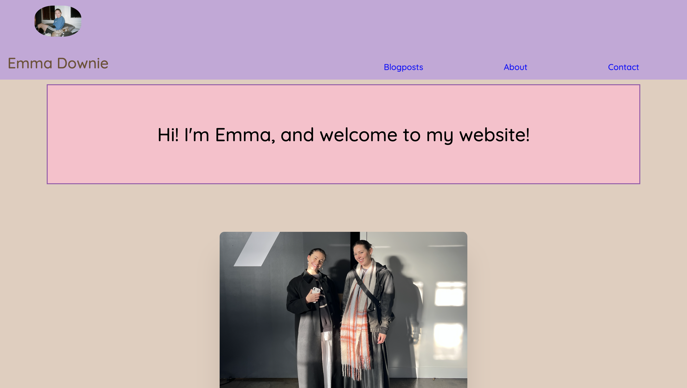
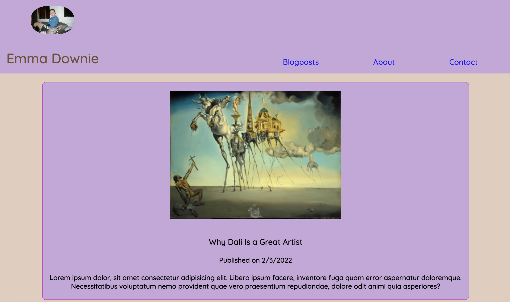
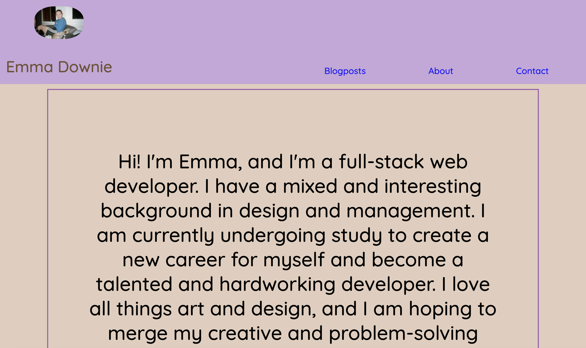
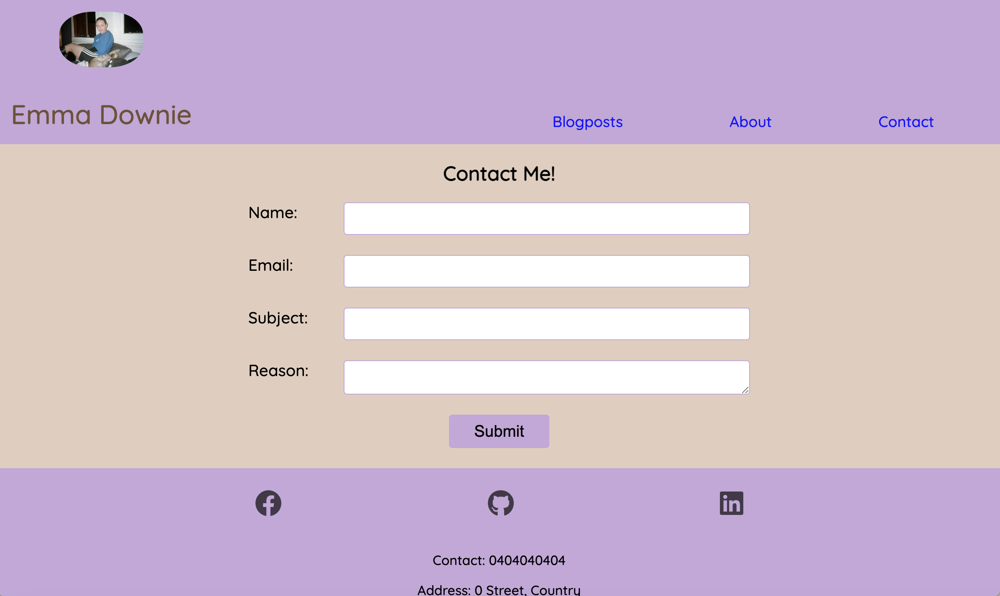
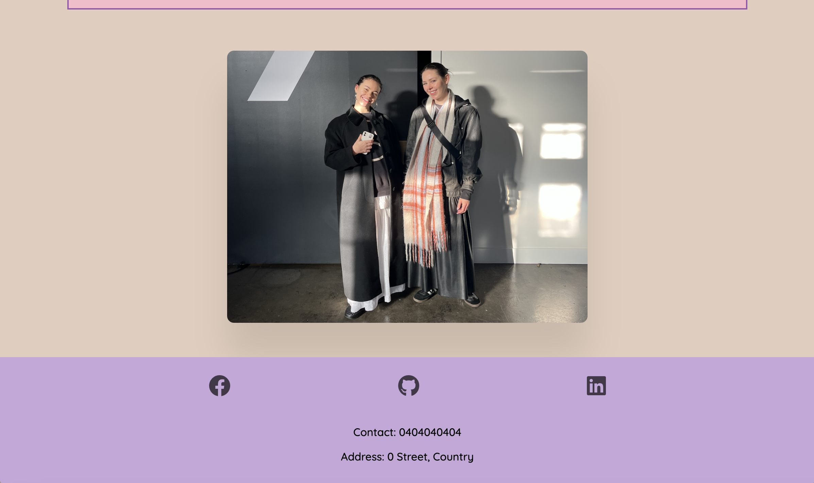

# Emma Downie Portfolio

### URL of portfolio
This is a [link to my website](https://main--incandescent-mochi-4920c3.netlify.app/).

### Link to github
This is a [link to my github](https://github.com/Emma-Downie/2023-OCT-portfolio)

## Description of Portfolio
* Purpose
The purpose of this site is to introduce myself as a web designer and show my abilities. It gives an introduction to who I am as a person including my interests and background, and shows prospective employers the kind of direction I would liek to go in.
* Functionality / features
The site is very easy to navigate, with clear colours and call to actions including links to new pages and a constant navigation back to the index page in the top left of every page.
* Sitemap

* Screenshots

* Target audience
The target audience is prospective employers, peers, and anyone interested in learning a little more about who I am as an individual and web developer.
* Tech stack
Includes html, scss, css, flexbox, github, netify, visual studio code.